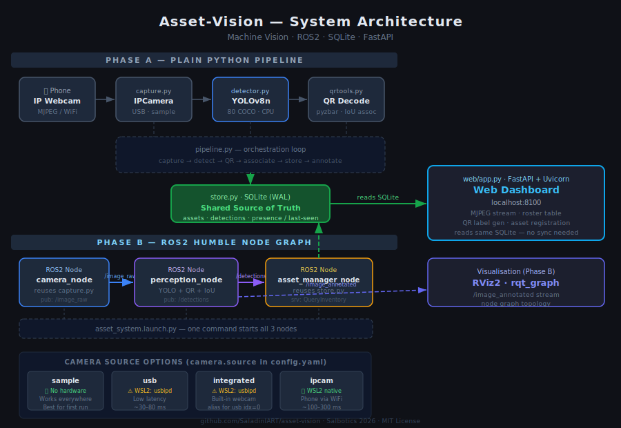
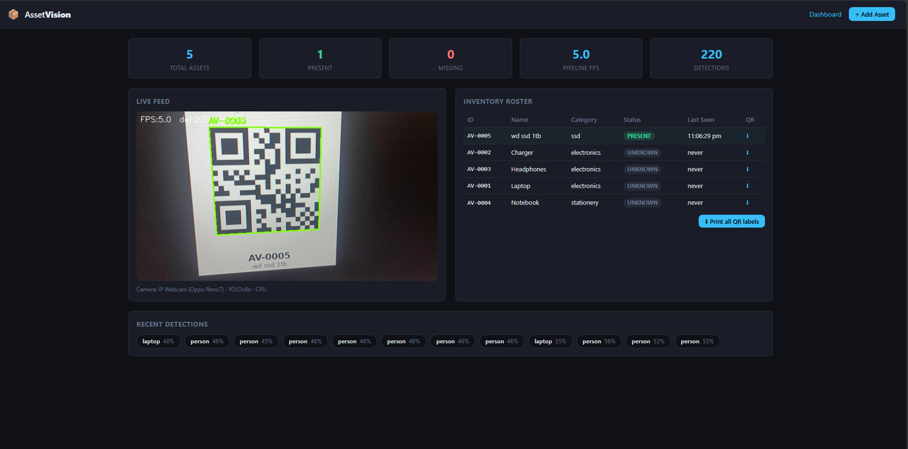

# Asset-Vision

[](https://github.com/SaladinIART/asset-vision/actions/workflows/ci.yml)

> **"I set out to build an asset-monitoring system. Once it worked, I realized the architecture was a robotics perception pipeline — so I re-built it on ROS2."**

A computer-vision inventory scanner that detects, identifies, and tracks personal belongings using a phone camera, YOLOv8, QR tags, SQLite, and a live web dashboard — re-architected as a full ROS2 Humble node graph in Phase B.

---

## Architecture



---

## Demo

### Phase A — Web dashboard (FastAPI)



**Live annotated feed · Inventory roster (present / missing) · One-click QR label printing**

### Phase B — ROS2 node graph

<!-- rqt_graph screenshot — capture with: ros2 launch asset_perception asset_system.launch.py source:=sample && rqt_graph -->
> 📷 *Live rqt_graph screenshot coming — see [LAUNCH_GUIDE.md](LAUNCH_GUIDE.md#demo-screenshot-checklist) for the capture steps.*

---

## The story

Most robotics tutorials start with ROS2 — install everything first, fight the config, then write hello-world. I did the opposite.

1. **I had a real problem:** I wanted to track my gear (laptop, charger, headphones, SSD) with a camera.
2. **I built it in plain Python first:** phone stream → YOLO detection → QR tag lookup → SQLite → web dashboard. When it worked, every piece had a clear, testable role.
3. **I noticed the pattern:** the pipeline was *sensor → perception → state management → interface*. That is the standard robotics perception stack.
4. **I refactored onto ROS2 (Phase B):** `camera_node` → `perception_node` → `asset_manager_node`, connected by typed topics and services, visualised in RViz2 and rqt_graph.

The result covers four things at once: **ML / machine vision · robotics (ROS2) · software integration · full-stack web**.

---

## Architecture detail

### Phase A — Plain Python

```
[Oppo Reno7]
  IP Webcam app (MJPEG over WiFi)
       │
       ▼
 capture.py ──► detector.py ──► qrtools.py
  OpenCV          YOLOv8n        pyzbar QR
  auto-reconnect  80 COCO cls    decode + IoU
       │               │              │
       └───────────────┴──────────────┘
                       │
                  pipeline.py
              (orchestration loop)
                       │
                  store.py
              SQLite · WAL mode
              assets + detections
              present / missing logic
                       │
                  web/app.py
              FastAPI · Uvicorn
              MJPEG stream · roster · QR gen
              http://localhost:8100
```

### Phase B — ROS2 Humble

```
┌─────────────────────────────────────────────────────────────────────────┐
│                         asset_system.launch.py                          │
│                  (one command brings up all 3 nodes)                    │
└────────────────────┬──────────────────┬─────────────────────────────────┘
                     │                  │
          ┌──────────▼──────────┐       │
          │    camera_node      │       │
          │  (capture.py +      │       │
          │   cv_bridge)        │       │
          │                     │       │
          │ pub: /image_raw     │       │
          │  sensor_msgs/Image  │       │
          └──────────┬──────────┘       │
                     │ /image_raw       │
          ┌──────────▼──────────┐       │
          │  perception_node    │       │
          │  (YOLOv8 + pyzbar   │       │
          │   + IoU assoc.)     │       │
          │                     │       │
          │ pub: /detections    │       │
          │   AssetDetections   │       │
          │ pub: /image_annotated│      │
          └──────────┬──────────┘       │
                     │ /detections      │
          ┌──────────▼──────────┐       │
          │ asset_manager_node  │       │
          │  (store.py reuse)   │       │
          │                     │       │
          │ writes: SQLite DB ──┼───────┼──► web dashboard
          │ srv: QueryInventory │       │    (same .db file,
          └─────────────────────┘       │     no sync needed)
                                        │
          ┌─────────────────────┐       │
          │  RViz2 / rqt_graph  │◄──────┘
          │  (visualisation)    │
          └─────────────────────┘
```

---

## ROS2 interfaces

### Messages (`asset_interfaces`)

**`DetectedAsset.msg`**
```
std_msgs/Header header
string  label           # YOLO class label (e.g. "laptop")
float32 confidence      # detection score 0–1
int32   x1 y1 x2 y2    # bounding box pixels
string  asset_id        # AV-xxxx if QR decoded, else ""
string  qr_payload      # raw QR string
```

**`AssetDetections.msg`**
```
std_msgs/Header  header
DetectedAsset[]  detections
int32   frame_width
int32   frame_height
float32 inference_ms    # YOLO inference time
```

### Service (`asset_interfaces`)

**`QueryInventory.srv`**
```
# Request
string status_filter    # "present" | "missing" | "" (all)
---
# Response
string[]  asset_ids
string[]  names
string[]  categories
string[]  statuses
float64[] last_seen     # Unix timestamps
int32     total_assets
int32     present_count
int32     missing_count
```

**Example call:**
```bash
ros2 service call /asset_manager_node/query_inventory \
  asset_interfaces/srv/QueryInventory "{status_filter: 'present'}"
```

---

## Hardware

| Component | Spec |
|-----------|------|
| CPU | Intel i5-1145G7 · 4C/8T · 2.6 GHz |
| RAM | 32 GB |
| GPU | Intel Iris Xe (no CUDA — pure CPU inference) |
| Platform | WSL2 Ubuntu 22.04 on Windows 11 |
| Camera | USB webcam (primary) · Oppo Reno7 **IP Webcam** app (WiFi fallback) |

CPU-only YOLOv8n achieves **~9 FPS** at 640 px on this hardware — sufficient for room-scale asset monitoring.

---

## Stack

| Layer | Tech |
|-------|------|
| Vision / ML | Ultralytics YOLOv8n · PyTorch (CPU) · OpenCV |
| QR | pyzbar (decode) · qrcode + Pillow (generate) |
| Storage | SQLite WAL (local source of truth) |
| Backend | FastAPI · Uvicorn |
| Frontend | Jinja2 · vanilla JS auto-refresh |
| Robotics | ROS2 Humble · colcon · cv_bridge · rqt · RViz2 |
| Platform | WSL2 Ubuntu 22.04 · mirrored networking |

---

## Quick start

### One-command setup (recommended)

```bash
# Clone and install — no camera needed
git clone https://github.com/SaladinIART/asset-vision.git
cd asset-vision
bash scripts/install.sh    # sets up venv, deps, samples, config

# Start the dashboard
bash scripts/run.sh        # → http://localhost:8100
```

The default `source: sample` mode works with **no hardware** — it loops the
bundled desk images through the full YOLO + QR + SQLite pipeline.

→ Full setup guide: **[INSTALL.md](INSTALL.md)**
→ Day-to-day usage: **[USAGE.md](USAGE.md)**
→ Camera choice guide: **[docs/CAMERA_SOURCES.md](docs/CAMERA_SOURCES.md)**

### Phase B — ROS2 pipeline

> The `asset_ws/` colcon workspace lives **inside the cloned repo**.
> Build it from there — not from `~/asset_ws`.

```bash
# From the repo root
source /opt/ros/humble/setup.bash
cd asset_ws
colcon build
source install/setup.bash

ros2 launch asset_perception asset_system.launch.py
```

Optional overrides:
```bash
ros2 launch asset_perception asset_system.launch.py \
  camera_url:=http://192.168.1.100:8080/video \
  target_fps:=10.0 \
  presence_window_sec:=120.0
```

Visualise:
```bash
rqt_graph          # node topology
rviz2 -d asset_ws/install/asset_perception/share/asset_perception/rviz/asset.rviz
```

→ Full ROS2 walkthrough: **[LAUNCH_GUIDE.md](LAUNCH_GUIDE.md)**

See **[LAUNCH_GUIDE.md](LAUNCH_GUIDE.md)** for the full step-by-step.

---

## Camera compatibility

The same pluggable code runs across three environments — pick the camera that matches your setup:

| Source | Windows (native) | WSL2 Ubuntu | Native Linux | Notes |
|--------|:---:|:---:|:---:|-------|
| `sample` — offline image loop | ✅ | ✅ | ✅ | **Default.** No hardware needed |
| `ipcam` — phone IP Webcam | ✅ | ✅ | ✅ | WiFi only; install [IP Webcam](https://play.google.com/store/apps/details?id=com.pas.webcam) |
| `usb` — USB camera | ✅ native | ⚠️ usbipd-win | ✅ | WSL2 needs [usbipd passthrough](docs/CAMERA_SOURCES.md#usbipd-win-full-walkthrough) |
| `integrated` — built-in webcam | ✅ native | ⚠️ usbipd-win | ✅ | Same as `usb`; Windows-native is the easiest path |

> **Tip:** On Windows, run Phase A natively (`.\scripts\run.ps1`) — direct camera access, no usbipd needed.
> On WSL2, `sample` and `ipcam` work out of the box; USB requires passthrough.

→ Full comparison: **[docs/CAMERA_SOURCES.md](docs/CAMERA_SOURCES.md)** · Windows setup: **[WINDOWS.md](WINDOWS.md)**

---

## Features

| Feature | Detail |
|---------|--------|
| Live annotated stream | MJPEG feed with YOLO bounding boxes + QR overlays |
| Asset registration | Name + category → SQLite + printable QR label PNG |
| Presence tracking | `last_seen` per asset; flips to **missing** after configurable window |
| Bulk QR sheet | `/api/sheet.png` — print all labels in one A4 layout |
| ROS2 service | `QueryInventory` — query roster by status from any ROS2 node |
| Shared DB | ROS2 nodes and web dashboard read/write the same SQLite file |

---

## What I learned

- Streaming MJPEG video from a phone into a Linux CV pipeline over WiFi — avoids USB/usbipd entirely
- Spatial association between two independent detectors (YOLO boxes + QR polygons) via IoU
- SQLite WAL mode for safe concurrent access from a real-time loop and a web server
- FastAPI `StreamingResponse` for multipart MJPEG boundaries
- ROS2 custom `msg` and `srv` definitions with `ament_cmake` + colcon
- Why **plain-Python-first** is the right way into ROS2: you understand *what* each node does before learning *how* ROS2 wires them together
- `sys.path` injection to reuse Phase A modules inside ROS2 nodes without duplicating code

---

## Project health

See [CHECKLIST.md](CHECKLIST.md) for checkpoint-by-checkpoint progress.

See [docs/SWOT.md](docs/SWOT.md) for the capability matrix and Strengths / Weaknesses / Opportunities / Threats breakdown (updated post Wave 3).

---

## Roadmap

- **Phase B** ✅ ROS2 Humble refactor (nodes, custom msg/srv, launch file, RViz2)
- Firebase sync (optional cloud dashboard)
- OpenVINO export for Intel Iris Xe acceleration
- Custom YOLO fine-tune on personal items
- Multi-camera / location zones
- Jazzy/Kilted rebuild (clean tutorial version for learners)

---

*Portfolio project · Salbotics · 2026 · [salbotics.uk](https://salbotics.uk)*
